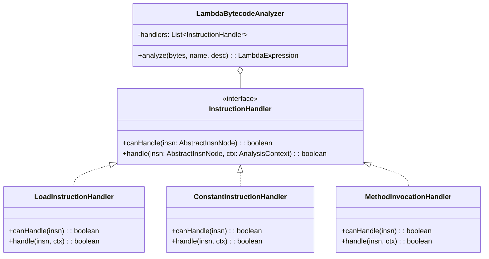
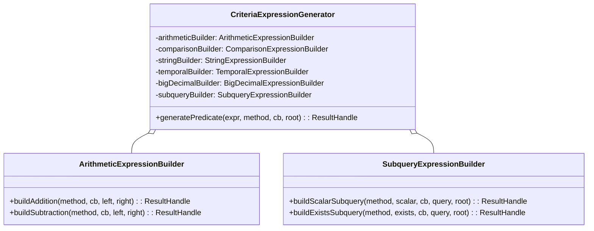
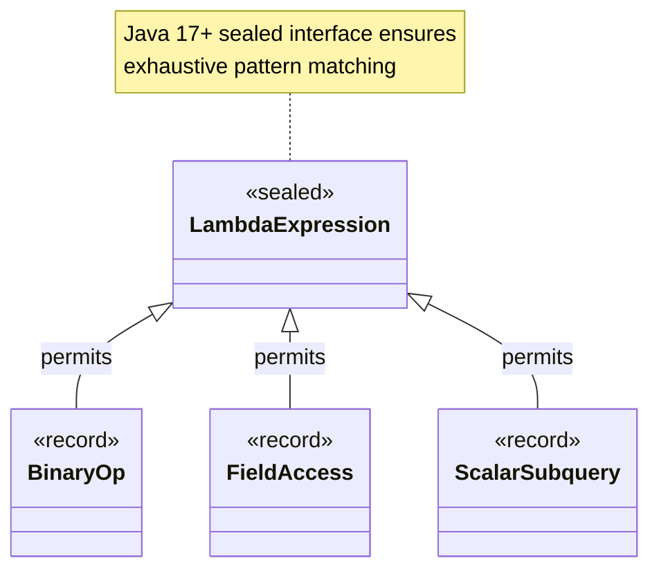

# QUSAQ Architecture Diagrams

This document provides comprehensive architectural diagrams for the QUSAQ (Quarkus USAQ) extension - a JINQ-inspired type-safe query DSL that transforms Java lambda expressions into JPA Criteria Queries at build time.

## Table of Contents

1. [High-Level Architecture](#1-high-level-architecture)
2. [Module Structure](#2-module-structure)
3. [Build-Time Processing Pipeline](#3-build-time-processing-pipeline)
4. [Lambda Bytecode Analysis Flow](#4-lambda-bytecode-analysis-flow)
5. [Instruction Handler Chain](#5-instruction-handler-chain)
6. [AST Node Hierarchy](#6-ast-node-hierarchy)
7. [JPA Criteria Generation Flow](#7-jpa-criteria-generation-flow)
8. [Runtime Query Execution](#8-runtime-query-execution)
9. [Subquery Processing](#9-subquery-processing)
10. [Group Query Processing](#10-group-query-processing)

---

## 1. High-Level Architecture

```mermaid
flowchart TB
    subgraph "Developer Code"
        UC[User Code<br/>Person.where&#40;p -> p.age > 21&#41;]
    end

    subgraph "Build Time &#40;Deployment Module&#41;"
        QP[QusaqProcessor<br/>@BuildStep orchestrator]
        IDS[InvokeDynamicScanner<br/>Lambda call site detection]
        CSP[CallSiteProcessor<br/>Analysis coordination]
        LBA[LambdaBytecodeAnalyzer<br/>Bytecode → AST]
        CEG[CriteriaExpressionGenerator<br/>AST → JPA bytecode]
        QEG[QueryExecutorClassGenerator<br/>Executor class generation]
    end

    subgraph "Runtime Module"
        QS[QusaqStream<br/>Fluent query interface]
        QE[QusaqEntity<br/>ActiveRecord base]
        RE[RuntimeExecutor<br/>Generated executors]
        EM[EntityManager<br/>JPA execution]
    end

    subgraph "Output"
        GC[Generated Classes<br/>*$$QueryExecutor]
        JPA[JPA Criteria Query<br/>Executed at runtime]
    end

    UC --> QP
    QP --> IDS
    IDS --> CSP
    CSP --> LBA
    LBA --> CEG
    CEG --> QEG
    QEG --> GC

    UC -.-> QS
    QS -.-> RE
    QE -.-> QS
    RE --> EM
    EM --> JPA
    GC -.-> RE
```

---

## 2. Module Structure

```mermaid
flowchart LR
    subgraph "deployment/"
        subgraph "io.quarkus.qusaq.deployment"
            QP[QusaqProcessor]
            LE[LambdaExpression<br/>&#40;sealed interface&#41;]
        end

        subgraph "analysis/"
            LBA[LambdaBytecodeAnalyzer]
            AC[AnalysisContext]
            BC[BranchCoordinator]
        end

        subgraph "analysis/handlers/"
            LIH[LoadInstructionHandler]
            CIH[ConstantInstructionHandler]
            AIH[ArithmeticInstructionHandler]
            TCH[TypeConversionHandler]
            IDH[InvokeDynamicHandler]
            MIH[MethodInvocationHandler]
        end

        subgraph "analysis/branch/"
            IEZH[IfEqualsZeroHandler]
            INZH[IfNotEqualsZeroHandler]
            TOCH[TwoOperandComparisonHandler]
            SOCH[SingleOperandComparisonHandler]
            NCH[NullCheckHandler]
        end

        subgraph "generation/"
            CEG[CriteriaExpressionGenerator]
            QEG[QueryExecutorClassGenerator]
        end

        subgraph "generation/builders/"
            AEB[ArithmeticExpressionBuilder]
            CEB[ComparisonExpressionBuilder]
            SEB[StringExpressionBuilder]
            TEB[TemporalExpressionBuilder]
            BDEB[BigDecimalExpressionBuilder]
            SQEB[SubqueryExpressionBuilder]
        end

        subgraph "scanning/"
            IDS[InvokeDynamicScanner]
            CSP[CallSiteProcessor]
        end
    end

    subgraph "runtime/"
        subgraph "io.quarkus.qusaq.runtime"
            QS[QusaqStream]
            QE[QusaqEntity]
            GR[Group &#40;interface&#41;]
            SQ[Subqueries]
            SQB[SubqueryBuilder]
        end

        subgraph "specs/"
            WS[WhereSpec]
            SS[SelectSpec]
            OS[OrderBySpec]
            BQS[BiQuerySpec]
            GQS[GroupQuerySpec]
        end
    end

    QP --> IDS
    QP --> CSP
    CSP --> LBA
    LBA --> AC
    LBA --> BC
    LBA --> LIH
    LBA --> MIH
    BC --> IEZH
    BC --> TOCH
    CSP --> CEG
    CSP --> QEG
    CEG --> AEB
    CEG --> SQEB
```



---

## 3. Build-Time Processing Pipeline

```mermaid
sequenceDiagram
    participant Q as Quarkus Build
    participant QP as QusaqProcessor
    participant IDS as InvokeDynamicScanner
    participant CSP as CallSiteProcessor
    participant LBA as LambdaBytecodeAnalyzer
    participant CEG as CriteriaExpressionGenerator
    participant QEG as QueryExecutorClassGenerator
    participant GC as Generated Class

    Q->>QP: @BuildStep processCandidates()
    QP->>IDS: scanForCallSites(classBytes)
    IDS-->>QP: List&lt;LambdaCallSiteInfo&gt;

    loop For each call site
        QP->>CSP: processCallSite(callSiteInfo)
        CSP->>LBA: analyze(classBytes, methodName, descriptor)
        LBA-->>CSP: LambdaExpression AST

        alt Single Entity Query
            CSP->>CEG: generatePredicate(ast, method, cb, root)
        else Bi-Entity Query (Join)
            CSP->>CEG: generateBiEntityPredicate(ast, method, cb, root, join)
        else Group Query
            CSP->>CEG: generateGroupPredicate(ast, method, cb, root)
        end

        CEG-->>CSP: JPA Criteria bytecode generated

        CSP->>QEG: generateQueryExecutorClass(context)
        QEG-->>CSP: ClassOutput
        CSP-->>GC: Person$$where$$lambda$0$$QueryExecutor.class
    end

    QP-->>Q: GeneratedClassBuildItem[]
```

---

## 4. Lambda Bytecode Analysis Flow

```mermaid
flowchart TB
    subgraph "Input"
        LB[Lambda Bytecode<br/>lambda$test$0&#40;LPerson;&#41;Z]
    end

    subgraph "LambdaBytecodeAnalyzer"
        CR[ClassReader<br/>Parse class bytes]
        CN[ClassNode<br/>AST representation]
        MN[MethodNode<br/>Lambda method]
        AC[AnalysisContext<br/>Stack + State]
    end

    subgraph "Instruction Processing Loop"
        BI{Branch<br/>Instruction?}
        ND{NEW/DUP<br/>Instruction?}
        DH[Delegate to<br/>Handler Chain]
        BC[BranchCoordinator<br/>Process branch]
        HND[Handle NEW/DUP<br/>Array creation]
    end

    subgraph "Handler Chain &#40;Strategy Pattern&#41;"
        H1[LoadInstructionHandler<br/>ALOAD, ILOAD, GETFIELD]
        H2[ConstantInstructionHandler<br/>LDC, ICONST, BIPUSH]
        H3[ArithmeticInstructionHandler<br/>IADD, ISUB, DCMPL]
        H4[TypeConversionHandler<br/>I2L, L2F, D2I]
        H5[InvokeDynamicHandler<br/>String concatenation]
        H6[MethodInvocationHandler<br/>INVOKE*]
    end

    subgraph "Output"
        AST[LambdaExpression AST<br/>BinaryOp&#40;FieldAccess, GT, Constant&#41;]
    end

    LB --> CR
    CR --> CN
    CN --> MN
    MN --> AC

    AC --> BI
    BI -->|Yes| BC
    BI -->|No| ND
    ND -->|Yes| HND
    ND -->|No| DH

    DH --> H1
    H1 -->|Not handled| H2
    H2 -->|Not handled| H3
    H3 -->|Not handled| H4
    H4 -->|Not handled| H5
    H5 -->|Not handled| H6

    H1 -->|Handled| AC
    H2 -->|Handled| AC
    H3 -->|Handled| AC
    H4 -->|Handled| AC
    H5 -->|Handled| AC
    H6 -->|Handled| AC
    BC --> AC
    HND --> AC

    AC -->|Final| AST
```



---

## 5. Instruction Handler Chain

```mermaid
flowchart TB
    subgraph "InstructionHandler Interface"
        IH["interface InstructionHandler<br/>+ canHandle(insn): boolean<br/>+ handle(insn, ctx): boolean"]
    end

    subgraph "Concrete Handlers"
        subgraph "LoadInstructionHandler"
            L1[ALOAD → Parameter/CapturedVariable]
            L2[ILOAD/LLOAD/FLOAD/DLOAD → Local variable]
            L3[GETFIELD → FieldAccess/PathExpression]
            L4[AALOAD → Array element access]
        end

        subgraph "ConstantInstructionHandler"
            C1[LDC → Constant &#40;String, Class, Number&#41;]
            C2[ICONST_* → Integer constant]
            C3[BIPUSH/SIPUSH → Byte/Short constant]
            C4[LCONST/FCONST/DCONST → Long/Float/Double]
            C5[ACONST_NULL → NullLiteral]
        end

        subgraph "ArithmeticInstructionHandler"
            A1[IADD/LADD/FADD/DADD → BinaryOp.ADD]
            A2[ISUB/LSUB/FSUB/DSUB → BinaryOp.SUB]
            A3[IMUL/LMUL/FMUL/DMUL → BinaryOp.MUL]
            A4[IDIV/LDIV/FDIV/DDIV → BinaryOp.DIV]
            A5[IREM/LREM → BinaryOp.MOD]
            A6[DCMPL/DCMPG/FCMPL/FCMPG → Comparison]
            A7[LCMP → Long comparison]
            A8[INEG/LNEG/FNEG/DNEG → Negate]
        end

        subgraph "TypeConversionHandler"
            T1[I2L/I2F/I2D → Integer widening]
            T2[L2I/L2F/L2D → Long conversion]
            T3[F2I/F2L/F2D → Float conversion]
            T4[D2I/D2L/D2F → Double conversion]
            T5[I2B/I2C/I2S → Integer narrowing]
            T6[CHECKCAST → Cast expression]
            T7[INSTANCEOF → InstanceOf expression]
        end

        subgraph "InvokeDynamicHandler"
            ID1[makeConcatWithConstants → String concatenation]
        end

        subgraph "MethodInvocationHandler"
            M1[INVOKEVIRTUAL equals → BinaryOp.EQ]
            M2[INVOKEVIRTUAL compareTo → MethodCall]
            M3[INVOKEVIRTUAL String.* → MethodCall]
            M4[INVOKEVIRTUAL BigDecimal.* → MethodCall]
            M5[INVOKEVIRTUAL getter → FieldAccess]
            M6[INVOKESTATIC temporal.of → Constant &#40;folded&#41;]
            M7[INVOKESPECIAL constructor → ConstructorCall]
            M8[INVOKEINTERFACE Collection.contains → IN/MEMBER OF]
            M9[INVOKEINTERFACE Group.* → GroupAggregation]
            M10[INVOKESTATIC Subqueries.subquery → SubqueryBuilderRef]
            M11[INVOKEVIRTUAL SubqueryBuilder.* → Subquery expressions]
        end
    end

    IH --> L1
    IH --> C1
    IH --> A1
    IH --> T1
    IH --> ID1
    IH --> M1
```



---

## 6. AST Node Hierarchy

```mermaid
classDiagram
    class LambdaExpression {
        <<sealed interface>>
    }

    class BinaryOp {
        +left: LambdaExpression
        +operator: Operator
        +right: LambdaExpression
    }

    class UnaryOp {
        +operator: Operator
        +operand: LambdaExpression
    }

    class FieldAccess {
        +fieldName: String
        +fieldType: Class
    }

    class PathExpression {
        +segments: List~PathSegment~
        +resultType: Class
        +requiresJoins(): boolean
        +depth(): int
    }

    class MethodCall {
        +target: LambdaExpression
        +methodName: String
        +arguments: List~LambdaExpression~
        +returnType: Class
    }

    class Constant {
        +value: Object
        +type: Class
        +TRUE: Constant$
        +FALSE: Constant$
        +ZERO_INT: Constant$
    }

    class Parameter {
        +name: String
        +type: Class
        +index: int
    }

    class CapturedVariable {
        +index: int
        +type: Class
    }

    class ConstructorCall {
        +className: String
        +arguments: List~LambdaExpression~
        +resultType: Class
    }

    class ArrayCreation {
        +elementType: String
        +elements: List~LambdaExpression~
        +resultType: Class
    }

    class InExpression {
        +field: LambdaExpression
        +collection: LambdaExpression
        +negated: boolean
    }

    class MemberOfExpression {
        +value: LambdaExpression
        +collectionField: LambdaExpression
        +negated: boolean
    }

    class BiEntityParameter {
        +name: String
        +type: Class
        +index: int
        +position: EntityPosition
    }

    class BiEntityFieldAccess {
        +fieldName: String
        +fieldType: Class
        +entityPosition: EntityPosition
    }

    class GroupKeyReference {
        +keyExpression: LambdaExpression
        +resultType: Class
    }

    class GroupAggregation {
        +aggregationType: GroupAggregationType
        +fieldExpression: LambdaExpression
        +resultType: Class
    }

    class ScalarSubquery {
        +aggregationType: SubqueryAggregationType
        +entityClass: Class
        +fieldExpression: LambdaExpression
        +predicate: LambdaExpression
        +resultType: Class
    }

    class ExistsSubquery {
        +entityClass: Class
        +predicate: LambdaExpression
        +negated: boolean
    }

    class InSubquery {
        +field: LambdaExpression
        +entityClass: Class
        +selectExpression: LambdaExpression
        +predicate: LambdaExpression
        +negated: boolean
    }

    LambdaExpression <|-- BinaryOp
    LambdaExpression <|-- UnaryOp
    LambdaExpression <|-- FieldAccess
    LambdaExpression <|-- PathExpression
    LambdaExpression <|-- MethodCall
    LambdaExpression <|-- Constant
    LambdaExpression <|-- Parameter
    LambdaExpression <|-- CapturedVariable
    LambdaExpression <|-- ConstructorCall
    LambdaExpression <|-- ArrayCreation
    LambdaExpression <|-- InExpression
    LambdaExpression <|-- MemberOfExpression
    LambdaExpression <|-- BiEntityParameter
    LambdaExpression <|-- BiEntityFieldAccess
    LambdaExpression <|-- GroupKeyReference
    LambdaExpression <|-- GroupAggregation
    LambdaExpression <|-- ScalarSubquery
    LambdaExpression <|-- ExistsSubquery
    LambdaExpression <|-- InSubquery
```



---

## 7. JPA Criteria Generation Flow

```mermaid
flowchart TB
    subgraph "Input"
        AST[LambdaExpression AST]
    end

    subgraph "CriteriaExpressionGenerator"
        GP[generatePredicate&#40;&#41;]
        GE[generateExpression&#40;&#41;]
        GC[generateComparison&#40;&#41;]
    end

    subgraph "Specialized Builders"
        AEB[ArithmeticExpressionBuilder<br/>+, -, *, /, %]
        CEB[ComparisonExpressionBuilder<br/>==, !=, &lt;, &gt;, <=, >=]
        SEB[StringExpressionBuilder<br/>startsWith, endsWith, contains, like]
        TEB[TemporalExpressionBuilder<br/>isBefore, isAfter, temporal functions]
        BDEB[BigDecimalExpressionBuilder<br/>add, subtract, multiply, divide]
        SQEB[SubqueryExpressionBuilder<br/>scalar, exists, in subqueries]
    end

    subgraph "Gizmo Bytecode Generation"
        MC[MethodCreator]
        RH[ResultHandle]
        MD[MethodDescriptor]
    end

    subgraph "Output"
        BC[JPA Criteria Bytecode<br/>cb.greaterThan&#40;root.get&#40;"age"&#41;, 21&#41;]
    end

    AST --> GP
    GP --> GE
    GE --> GC

    GC --> AEB
    GC --> CEB
    GC --> SEB
    GC --> TEB
    GC --> BDEB
    GC --> SQEB

    AEB --> MC
    CEB --> MC
    SEB --> MC
    TEB --> MC
    BDEB --> MC
    SQEB --> MC

    MC --> RH
    RH --> MD
    MD --> BC
```

---

## 8. Runtime Query Execution

```mermaid
sequenceDiagram
    participant UC as User Code
    participant QE as QusaqEntity
    participant QS as QusaqStream
    participant RE as RuntimeExecutor
    participant GE as Generated Executor
    participant EM as EntityManager
    participant CB as CriteriaBuilder
    participant CQ as CriteriaQuery
    participant TQ as TypedQuery
    participant DB as Database

    UC->>QE: Person.where(p -> p.age > 21)
    QE->>QS: new QusaqStream(Person.class, executor)

    UC->>QS: .sortedBy(p -> p.name)
    QS-->>QS: Chain method

    UC->>QS: .toList()
    QS->>RE: executeQuery()
    RE->>GE: lookup generated executor

    GE->>EM: getCriteriaBuilder()
    EM-->>GE: CriteriaBuilder cb

    GE->>CB: createQuery(Person.class)
    CB-->>GE: CriteriaQuery cq

    GE->>CQ: from(Person.class)
    CQ-->>GE: Root root

    Note over GE: Execute generated predicate bytecode
    GE->>CB: greaterThan(root.get("age"), 21)
    CB-->>GE: Predicate

    GE->>CQ: where(predicate)
    GE->>CQ: orderBy(cb.asc(root.get("name")))

    GE->>EM: createQuery(cq)
    EM-->>GE: TypedQuery tq

    GE->>TQ: getResultList()
    TQ->>DB: SELECT * FROM person WHERE age > 21 ORDER BY name
    DB-->>TQ: ResultSet
    TQ-->>GE: List&lt;Person&gt;
    GE-->>QS: List&lt;Person&gt;
    QS-->>UC: List&lt;Person&gt;
```

---

## 9. Subquery Processing

```mermaid
flowchart TB
    subgraph "User Lambda"
        UL["p -> p.salary > subquery(Person.class)<br/>.where(q -> q.department.equals(p.department))<br/>.avg(q -> q.salary)"]
    end

    subgraph "Analysis Phase"
        SQ1[Detect Subqueries.subquery&#40;&#41;]
        SQ2[Create SubqueryBuilderReference]
        SQ3[Process .where&#40;&#41; → Add predicate]
        SQ4[Process .avg&#40;&#41; → Create ScalarSubquery]
        SQ5[Detect CorrelatedVariable for p.department]
    end

    subgraph "Generated AST"
        AST["BinaryOp(<br/>  left: FieldAccess('salary'),<br/>  op: GT,<br/>  right: ScalarSubquery(<br/>    type: AVG,<br/>    entity: Person,<br/>    field: FieldAccess('salary'),<br/>    predicate: BinaryOp(<br/>      left: PathExpression('department'),<br/>      op: EQ,<br/>      right: CorrelatedVariable(p.department)<br/>    )<br/>  )<br/>)"]
    end

    subgraph "Code Generation"
        CG1[Create main query: cq.from&#40;Person&#41;]
        CG2[Create subquery: cq.subquery&#40;Double&#41;]
        CG3[Subquery from: sq.from&#40;Person&#41;]
        CG4[Generate predicate with outer root correlation]
        CG5[Apply aggregation: cb.avg&#40;...&#41;]
        CG6[Compare: cb.gt&#40;root.get&#40;salary&#41;, subquery&#41;]
    end

    subgraph "Generated JPA"
        JPA["Subquery&lt;Double&gt; avgSalary = cq.subquery(Double.class);<br/>Root&lt;Person&gt; subRoot = avgSalary.from(Person.class);<br/>avgSalary.where(cb.equal(<br/>  subRoot.get('department'),<br/>  root.get('department')<br/>));<br/>avgSalary.select(cb.avg(subRoot.get('salary')));<br/>cq.where(cb.gt(root.get('salary'), avgSalary));"]
    end

    UL --> SQ1
    SQ1 --> SQ2
    SQ2 --> SQ3
    SQ3 --> SQ4
    SQ4 --> SQ5
    SQ5 --> AST

    AST --> CG1
    CG1 --> CG2
    CG2 --> CG3
    CG3 --> CG4
    CG4 --> CG5
    CG5 --> CG6
    CG6 --> JPA
```



---

## 10. Group Query Processing

```mermaid
flowchart TB
    subgraph "User Code"
        UC["Person.groupBy(p -> p.department)<br/>.select(g -> new Object[]{g.key(), g.count()})<br/>.toList()"]
    end

    subgraph "GroupBy Analysis"
        GB1[Parse groupBy lambda: p -> p.department]
        GB2[Extract key expression: FieldAccess&#40;'department'&#41;]
        GB3[Create GroupQuerySpec context]
    end

    subgraph "Select Analysis"
        SE1[Parse select lambda: g -> new Object[]...]
        SE2[Detect ArrayCreation for multi-value projection]
        SE3[Process g.key&#40;&#41; → GroupKeyReference]
        SE4[Process g.count&#40;&#41; → GroupAggregation&#40;COUNT&#41;]
    end

    subgraph "Generated AST"
        AST["ArrayCreation(<br/>  elements: [<br/>    GroupKeyReference(null, Object),<br/>    GroupAggregation(COUNT, null, long)<br/>  ],<br/>  resultType: Object[]<br/>)"]
    end

    subgraph "Code Generation"
        CG1[Create query with Object[] result type]
        CG2[Generate GROUP BY: cq.groupBy&#40;root.get&#40;'department'&#41;&#41;]
        CG3[Generate multiselect: cq.multiselect&#40;...&#41;]
        CG4[Add key expression to select]
        CG5[Add cb.count&#40;root&#41; to select]
    end

    subgraph "Generated JPA"
        JPA["CriteriaQuery&lt;Object[]&gt; cq = cb.createQuery(Object[].class);<br/>Root&lt;Person&gt; root = cq.from(Person.class);<br/>cq.multiselect(<br/>  root.get('department'),<br/>  cb.count(root)<br/>);<br/>cq.groupBy(root.get('department'));"]
    end

    UC --> GB1
    GB1 --> GB2
    GB2 --> GB3
    GB3 --> SE1
    SE1 --> SE2
    SE2 --> SE3
    SE3 --> SE4
    SE4 --> AST

    AST --> CG1
    CG1 --> CG2
    CG2 --> CG3
    CG3 --> CG4
    CG4 --> CG5
    CG5 --> JPA
```

---

## Appendix: Key Design Patterns

### Strategy Pattern (Instruction Handlers)


### Builder Pattern (Expression Builders)


### Sealed Hierarchy (Type Safety)


---

## Version History

| Version | Date | Author | Changes |
|---------|------|--------|---------|
| 1.0 | 2024 | QUSAQ Team | Initial architecture documentation |

